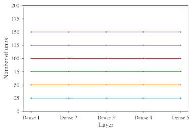

# Dynamic Auto-Sizing

Implementation of the **dynamic auto-sizing technique** which we presented in the paper [Adapting the Size of Artificial Neural Networks Using Dynamic Auto-Sizing](https://doi.org/10.1109/CSIT56902.2022.10000471). Dynamic auto-sizing allows artificial neural networks to automatically adapt their size to the problem domain. Besides the TensorFlow implementation of dynamic auto-sizing, this repository additionally contains the complete Jupyter notebooks with experiments.

## Repository structure

* *nets* - Python package with the implementations
* *notebooks* - Jupyter notebooks with experiments
    * *standalone* - Experiments with dynamic auto-sizing
    * *anytime* - Experiments with dynamic auto-sizing as an underlying technique for anytime algorithms
    * *misc* - Supporting code, e.g. for the rendering of figures

## How to run

1. Clone the repository, `cd` into it.
2. Install required packages by running `pip install -r requirements.txt` (Python version 3.9 is recommended).
3. Open Jupyter Lab using `jupyter lab`.

## Citing

In case you find this repository dataset helpful, feel free to cite our related publication [Adapting the Size of Artificial Neural Networks Using Dynamic Auto-Sizing](https://doi.org/10.1109/CSIT56902.2022.10000471):

    @inproceedings{10000471,
        title        = {Adapting the Size of Artificial Neural Networks Using Dynamic Auto-Sizing},
        author       = {Cahlik, Vojtech and Kordik, Pavel and Cepek, Miroslav},
        year         = 2022,
        booktitle    = {2022 IEEE 17th International Conference on Computer Sciences and Information Technologies (CSIT)},
        volume       = {},
        number       = {},
        pages        = {592--596},
        doi          = {10.1109/CSIT56902.2022.10000471}
    }
